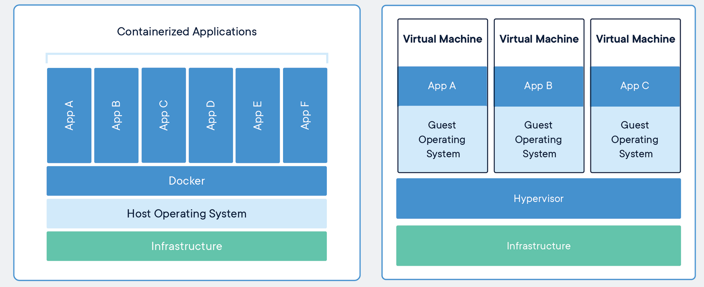
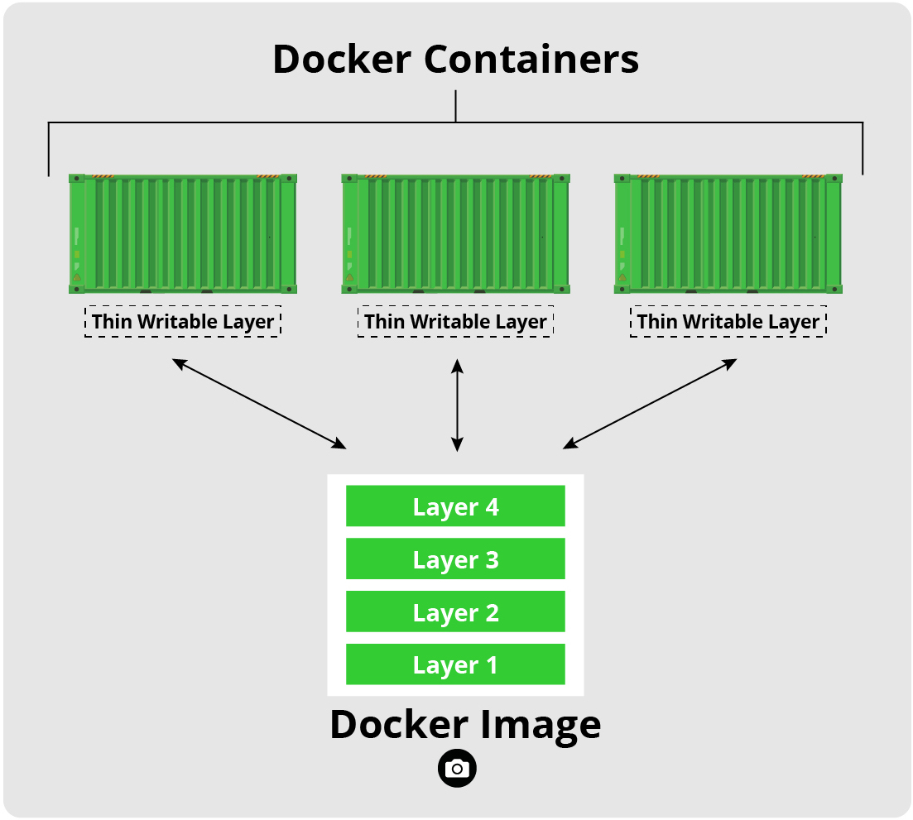

# Containers and Images

Containers are like lightweight virtual machines. They behave as if they were their own complete OS, but actually only contain the components necessary to operate. Instead, containers share the host machine's system kernel, significantly reducing their size. In essence, they run a second OS natively on the host machine with just a thin additional layer, which means they can be faster than traditional virtual machines. These container only take up as much memory as necessary, which allows many of them to be run simultaneously and they can be spun up quite rapidly.

 

Images are read-only templates that contain a set of instructions for creating a container. Different container orchestration programs have different formats for these images. Often a single image is made of several files (layers) which contain all of the dependencies and application code necessary to create and configure the container environment. In other words, [Docker containers][docker-containers] are the runtime instances of images &mdash; they
are images with a state.

This allows us to package up an application with just the dependencies we need (OS and libraries) and then deploy that image as a single package. This allows us to:
1. replicate our environment/workflow on other host machines
2. run a program on a host OS other than the one for which is was designed (**not 100% foolproof**)
3. sandbox our applications in a secure environment (**still important to take proper safety measures**)

# Docker

Docker is a multifaceted tool used to work with images and containers. You can think of the container life cycle as needing three components:
1. A way to programmatically define and build and image
2. A way to run a container
3. A way to manage images and orchestrate many containers
Docker and its various components satisfy this entire ecosystem.

### Documentation

The [official Docker documentation and tutorial][docker-tutorial] can be found on the
Docker website.
It is quite thorough and useful.
It is an excellent guide that should be routinely visited, but the emphasis of this
introduction is on using Docker, not how Docker itself works.

As a side note, Docker has very similar syntax to Git and Linux, so if you are familiar
with the command line tools for them then most of Docker should seem somewhat natural
(though you should still read the docs!).

[docker-tutorial]: https://docs.docker.com/get-started
[docker-containers]: https://www.docker.com/resources/what-container

# Container Tool-chain Ecosystem

Docker is one among many container platforms which are governed by the [Open Container Initiative (OCI)](https://opencontainers.org/). Started by Docker and others in 2015, the OCI fosters industry standards and innovation among the various groups developing container environments. The OCI defines an image specification (image-spec) and a runtime specification (runtime-spec). These specifications provide for common ways to download, unpack, and run images/containers, allowing for greater interoperability among the containerization tool-chains. This way we can choose to work with Docker, Podman, Buildah, OpenShift, and others.


