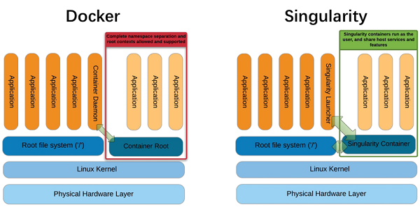

# Introduction

One thing that has not been covered in detail is that containers do not
necessarily have to be executed using Docker. While Docker is the most popular containerization tool these days, there are several so-called
container run-times that allow the execution of containers. The one chosen by CMS for invisibly running CRAB/HTCondor pilot jobs is [Singularity][singularity-docs], which is [centrally supported and documented][cms-singularity]. The main reason for choosing Singularity is that it is popular in high-performance and high-throughput computing and does not require any root privileges.

While executing images on CMSLPC/LXPLUS and HTCondor is more practical with
Singularity, running in GitLab CI is by default done using Docker. Since
Singularity uses a proprietary image format, but supports reading and
executing Docker images, building images is better done using Docker.

The previous episode has given you an idea how complicated it can be
to run containers with CVMFS access on your computer. However, at the
same time it gives you the possibility to develop code on a computer
that doesn't need to know anything about CMS software in the first place.
The only requirement is that Docker is installed. These same container can then be run in GitLab CI/CD via Docker.

You will also have noticed that in several cases *privileged* containers
are needed. These are not available to you on CMSLPC/LXPLUS (nor is the `docker` command). On CMSLPC/LXPLUS, the tool to run containers is Singularity. **The following commands will therefore all be run on CMSLPC** (`cmslpc-sl7.fnal.gov` or specifically).

> ## Docker vs Singularity
> The [RECAST FAQ](https://recast-docs.web.cern.ch/recast-docs/faq/#q-how-are-docker-and-singularity-different) includes a brief intro to the important differences between docker and singularity. 
{: .callout}

# CMS documentation on Singularity

Before we go into any detail, you should be aware of the
[central CMS documentation][cms-singularity]. These commands are only
available via `/cvmfs/cms.cern.ch/common`. The `cmssw-env` command is
actually a shell script that sets some variables automatically and then
runs Singularity. The nice thing about Singularity is that you can
mount `/cvmfs`, `/eos`, and `/afs` without any workarounds. This is
automatically done when running the `cmssw-env` command.

> ## Exercise: Run the CC8 Singularity container
>
> Confirm that you can access your home directory (`~` or `${HOME}`), EOS area
> (`/eos/uscms/store/user/${USER}` on cmslpc), and 'nobackup' directory (`${HOME}/nobackup` on cmslpc) from within the Singularity CC8 shell.
>
> > ## Solution: Run the CC8 Singularity container
> >
> > ~~~bash
> > cat /etc/redhat-release
> > cmssw-cc8 --bind `readlink -f ${HOME}/nobackup/`
> > cat /etc/redhat-release
> > ls /eos/uscms/store/user/${USER}
> > ls ${HOME}
> > ls ${HOME}/nobackup
> > exit
> > ~~~
> > {: .source}
> {: .solution}
{: .challenge}

# Running custom images with Singularity

The CMS script discussed above is "nice-to-have" and works well if you simply want to run some CMSSW code on a different Linux distribution, but it also hides a lot of the complexity when running Singularity. For the purpose of running your analysis image, we cannot use the script above, but instead need to run Singularity manually.

As an example, we are going to run a container using the `ubuntu:latest` image. Before running Singularity, you should set the cache directory (i.e.
the directory to which the images are being pulled) to a
place outside your `$HOME`/AFS space (here we use the `~/nobackup` directory):

~~~bash
export SINGULARITY_CACHEDIR="`readlink -f ~/nobackup/`/.singularity/cache"
singularity shell -B `readlink $HOME` -B `readlink -f ${HOME}/nobackup/` -B /cvmfs docker://ubuntu:latest
# try accessing cvmfs inside of the container
source /cvmfs/cms.cern.ch/cmsset_default.sh
~~~
{: .source}

~~~
INFO:    Converting OCI blobs to SIF format
INFO:    Starting build...
Getting image source signatures
Copying blob 345e3491a907 done
Copying blob 57671312ef6f done
Copying blob 5e9250ddb7d0 done
Copying config 7c6bc52068 done
Writing manifest to image destination
Storing signatures
2021/06/08 01:10:42  info unpack layer: sha256:345e3491a907bb7c6f1bdddcf4a94284b8b6ddd77eb7d93f09432b17b20f2bbe
2021/06/08 01:10:44  info unpack layer: sha256:57671312ef6fdbecf340e5fed0fb0863350cd806c92b1fdd7978adbd02afc5c3
2021/06/08 01:10:44  info unpack layer: sha256:5e9250ddb7d0fa6d13302c7c3e6a0aa40390e42424caed1e5289077ee4054709
INFO:    Creating SIF file...
INFO:    Converting SIF file to temporary sandbox...
WARNING: underlay of /etc/localtime required more than 50 (66) bind mounts
~~~
{: .output}

If you are asked for a docker username and password, just hit
enter twice.

It's not really a great practice to bind `/eos/uscms` into the container and you really shouldn't need to use the EOS fuse mount anyway.

One particular difference from Docker is that the image name needs to be prepended by `docker://` to tell Singularity that this is a Docker image. Singularity has its own registry system, which doesn't have a de facto default registry like [Docker Hub][docker-hub].

As you can see from the output, Singularity first downloads the layers
from the registry, and is then unpacking the layers into a format that
can be read by Singularity, the Singularity Image Format (SIF). This is a somewhat technical detail, but is different from Docker. It then unpacks the SIF file into  what it calls a *sandbox*, the uncompressed image files needed to make the container.

> ## `-B` (bind strings)
>
> The -B option allows the user to specify paths to bind to the Singularity container. This option is similar to '-v' in docker. By default paths are mounted as rw (read/write), but can also be specified as ro (read-only).
>
> You must bind any mounted file systems to which you would like access (i.e. `nobackup`).
> 
> If you would like Singularity to run your `.bashrc` file on startup, you must bind mount your home directory.
{: .callout}

In the next example, we are executing a script with singularity using the same image.

~~~bash
export SINGULARITY_CACHEDIR="`readlink -f ~/nobackup/`/.singularity/cache"
echo -e '#!/bin/bash\n\necho "Hello World!"\n' > hello_world.sh
singularity exec -B `readlink $HOME` -B `readlink -f ${HOME}/nobackup/` docker://ubuntu:latest bash hello_world.sh
~~~
{: .source}

> ## `exec` vs. `shell`
>
> Singularity differentiates between providing you with an
> interactive shell (`singularity shell`) and executing scripts
> non-interactively (`singularity exec`).
>
{: .callout}

## Saving the Singularity Sandbox

You may have noticed that singularity caches both the Docker and SIF images so that they don't need to be pulled/created on subsequent Singularity calls. That said, the sandbox needed to be created each time we started a container. If you will be using the same container multiple times, it may be useful to store the sandbox and use that to start the container.

Begin by building and storing the sandbox:

~~~bash
export SINGULARITY_CACHEDIR="`readlink -f ~/nobackup/`/.singularity/cache"
singularity build --sandbox ubuntu/ docker://ubuntu:latest
~~~
{: .source}

~~~
INFO:    Starting build...
Getting image source signatures
Copying blob 345e3491a907 skipped: already exists
Copying blob 57671312ef6f skipped: already exists
Copying blob 5e9250ddb7d0 [--------------------------------------] 0.0b / 0.0b
Copying config 7c6bc52068 done
Writing manifest to image destination
Storing signatures
2021/06/08 01:13:24  info unpack layer: sha256:345e3491a907bb7c6f1bdddcf4a94284b8b6ddd77eb7d93f09432b17b20f2bbe
2021/06/08 01:13:24  warn xattr{etc/gshadow} ignoring ENOTSUP on setxattr "user.rootlesscontainers"
2021/06/08 01:13:24  warn xattr{/uscms_data/d2/aperloff/build-temp-220308461/rootfs/etc/gshadow} destination filesystem does not support xattrs, further warnings will be suppressed
2021/06/08 01:13:47  info unpack layer: sha256:57671312ef6fdbecf340e5fed0fb0863350cd806c92b1fdd7978adbd02afc5c3
2021/06/08 01:13:47  info unpack layer: sha256:5e9250ddb7d0fa6d13302c7c3e6a0aa40390e42424caed1e5289077ee4054709
INFO:    Creating sandbox directory...
INFO:    Build complete: ubuntu/
~~~
{: .output}

Once we have the sandbox we can use that when starting the container. Run the same command as before, but use the sandbox rather than the Docker image:

~~~bash
export SINGULARITY_CACHEDIR="`readlink -f ~/nobackup/`/.singularity/cache"
singularity exec -B `readlink $HOME` -B `readlink -f ${HOME}/nobackup/` ubuntu/ bash hello_world.sh
~~~
{: .source}

~~~
WARNING: underlay of /etc/localtime required more than 50 (66) bind mounts
Hello World!
~~~
{: .output}

You will notice that the startup time for the container is significantly reduced.

## Authentication with Singularity

In case your image is not public, you can authenticate to
the registry in two different ways: either you append the
option `--docker-login` to the `singularity` command, which
makes sense when running interactively, or via environment
variables (e.g. on GitLab):

~~~
export SINGULARITY_DOCKER_USERNAME=${CERNUSER}
export SINGULARITY_DOCKER_PASSWORD='mysecretpass'
~~~
{: .language-bash}

Knowing how to authenticate will be important when pulling images from GitLab. For example:

~~~bash
export SINGULARITY_CACHEDIR="`readlink -f ~/nobackup/`/.singularity/cache"
singularity shell -B `readlink $HOME` -B `readlink -f ${HOME}/nobackup/` docker://gitlab-registry.cern.ch/[repo owner's username]/[repo name]:[tag] --docker-login
~~~
{: .source}

# Custom containers for machine learning at the LPC

There are three GPUs available for use at the LPC. Rather than installing the myriad of packages necessary for machine learning on the bare-metal machines or manually synchronizing an Anaconda distribution to CVMFS (as done in the past), custom Singularity images have been built for this purpose.

Currently we have three images built and ready to use:
1. [PyTorch][pytorch] 1.8.1 w/ CUDA 11.1 ([Dockerfile](https://github.com/FNALLPC/fnallpc-docker/blob/singularity-compatible/PyTorch/Dockerfile))
1. [TensorFlow][tensorflow] (GPU) 2.3.0 w/ development libraries ([Dockerfile](https://github.com/FNALLPC/fnallpc-docker/blob/singularity-compatible/TensorFlow/Dockerfile))
1. [TensorFlow][tensorflow] (GPU) 2.3.0 w/o development libraries ([Dockerfile](https://github.com/FNALLPC/fnallpc-docker/blob/singularity-compatible/TensorFlow/Dockerfile))

Of course there are many more packages installed in these images than just PyTorch or TensorFlow. If you don't see the exact variety you need, tell us and we can probably make it in ~1 day. The images are stored on [Docker Hub][docker-hub-fnallpc-docker].

> ## Access to the GPU
> 
> In order to give the container access to the CUDA drivers and GPU on the host machine you will need to add the `--nv` option to your `singularity` command.
{: .callout}

> ## Using Jupyter within the image
> 
> You can start Jupyter Notebook using the `singularity exec` command, passing the directive `jupyter notebook --no-browser --port <port_number>` at the end of the command. Singularity, unlike Docker, doesn't require explicit port mapping. For example:
> ~~~bash
> singularity exec --nv --bind $PWD:/run/user --bind `readlink -f ${HOME}/nobackup/` /cvmfs/unpacked.cern.ch/registry.hub.docker.com/fnallpc/fnallpc-docker:pytorch-1.8.1-cuda11.1-cudnn8-runtime-singularity jupyter notebook --no-browser --port 1234
> ~~~
> {: .source}
{: .callout}

A word of warning, these images are rather large (about 5 GB compressed). For that reason, it would be prohibitively expensive to make each user download, convert, and uncompress the images. Therefore, the unpacked sandboxes are stored on CVMFS at `/cvmfs/unpacked.cern.ch/registry.hub.docker.com/fnallpc/`. The service which does the unpacking and uploading to CVMFS will be discussed in detail in the next lesson. For now we'll just say, use the unpacked images if working with Singularity.

> ## Exercise: PyTorch workflow
> Try to run a simple PyTorch workflow on a machine with a GPU
> > ## Solution
> > Log into one of the cmslpc GPU nodes and start a PyTorch container.
> > ~~~bash
> > ssh -Y <username>@cmslpcgpu<2-3>.fnal.gov
> > export SINGULARITY_CACHEDIR="`readlink -f ~/nobackup/`/.singularity/cache"
> > singularity shell --nv --bind $PWD:/run/user --bind `readlink -f ${HOME}/nobackup/` /cvmfs/unpacked.cern.ch/registry.hub.docker.com/fnallpc/fnallpc-docker:pytorch-1.8.1-cuda11.1-cudnn8-runtime-singularity
> > ~~~
> > {: .source}
> > Create a script called `testPytorch.py` which has the following content:
> > ~~~python
> > #!/usr/bin/env python
> >
> > import torch
> > from datetime import datetime
> > 
> > print("torch.version.cuda = ",torch.version.cuda)
> > print("torch._C._cuda_getCompiledVersion() = ",torch._C._cuda_getCompiledVersion())
> >
> > for i in range(10):
> >     x = torch.randn(10, 10, 10, 10) # similar timings regardless of the tensor size
> >     t1 = datetime.now()
> >     x.cuda()
> >     print(i, datetime.now() - t1)
> > ~~~
> > {: .source}
> > Execute that script using:
> > ~~~bash
> > python testPytorch.py
> > ~~~
> > {: .source}
> > You should see an output which looks similar to:
> > ~~~
> > torch.version.cuda =  11.1
> > torch._C._cuda_getCompiledVersion() =  11010
> > 0 0:00:45.501856
> > 1 0:00:00.000083
> > 2 0:00:00.000066
> > 3 0:00:00.000041
> > 4 0:00:00.000041
> > 5 0:00:00.000040
> > 6 0:00:00.000038
> > 7 0:00:00.000039
> > 8 0:00:00.000041
> > 9 0:00:00.000039
> > ~~~
> > {: .output}
> {: .solution}
{: .challenge}

> ## Other useful singularity images for CMS analyzers
>  There are some additional, ready-made Singularity images which might be useful to know about. Those include:
>  - [Pre-built coffea + scientific python environment](https://coffeateam.github.io/coffea/installation.html#pre-built-images)
>    - Great if you want a ready to use environment with all of the most popular dependencies pre-installed
>    - There are also Docker images available
>  - [SONIC for Triton Inference Server](https://github.com/cms-sw/cmssw/blob/master/HeterogeneousCore/SonicTriton/README.md)
>    - The image runs the Nvidia Triton inference server needed by SONIC
>    - Can access local CPU and/or GPU resources
>    - Can be run using Docker instead of Singularity if needed
> 
{: .testimonial}

[tensorflow]: https://www.tensorflow.org/
[pytorch]: https://pytorch.org/
[docker-hub-fnallpc-docker]: https://hub.docker.com/repository/docker/fnallpc/fnallpc-docker/tags?page=1

