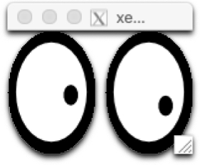

**At the moment, this is the method I recommend!** This image has been developed for the most demanding of CMSSW use cases. It can do everything the previous containers do and then some. It's also been configured to comply with the Fermilab security policies, at least pre-COVID-19 (I haven't tested this lately). It is based on the Docker official `sl:7` image. The most up-to-date and comprehensive documentation can be found in the projects [GitHub README](https://github.com/aperloff/cms-cvmfs-docker/blob/master/README.md).

The benefits of this image include:
1. X11 and VNC support.
2. Host UID and GID mapping inside the container.
3. Some rudimentary CVMFS mount verification and re-mounting support.
4. Greater support for a variety of CVMFS mounts:
    * cms.cern.ch
    * cms-ib.cern.ch
    * oasis.opensciencegrid.org
    * cms-lpc.opensciencegrid.org
    * sft.cern.ch
    * cms-bril.cern.ch
    * cms-opendata-conddb.cern.ch
5. The ability to mount all, a subset, or none of the CVMFS mount points.
6. The image still allows access even if CVMFS is unreachable.
7. No ability to `sudo`.

# Basics

Like most Docker containers, the basic run command for this container is:
~~~bash
docker run --rm -it aperloff/cms-cvmfs-docker:latest
~~~
{: .source}

While the `--rm` is not strictly necessary, it is useful for this tutorial so that we don't end up with a huge number of containers at the end. The output will look something like:

~~~
chmod: cannot access '/dev/fuse': No such file or directory
MY_UID variable not specified, defaulting to cmsuser user id (1000)
MY_GID variable not specified, defaulting to cmsuser user group id (1000)
Not mounting any filesystems.
Not necessary to check the CVMFS mounts points.
Unable to source /cvmfs/cms.cern.ch/cmsset_default.sh
Unable to setup the grid utilities from /cvmfs/oasis.opensciencegrid.org/
~~~
{: .output}

Many of these warnings are simply because we haven't yet given the container the ability to mount CVMFS. Others are simply informative. The user should be fully informed of the containers state by the time it start up.

# Mounting CVMFS

Next we will give the container the ability to mount CVMFS:

~~~bash
docker run --rm -it --device /dev/fuse --cap-add SYS_ADMIN -e CVMFS_MOUNTS="cms.cern.ch oasis.opensciencegrid.org" aperloff/cms-cvmfs-docker:latest
~~~
{: .source}

~~~
MY_UID variable not specified, defaulting to cmsuser user id (1000)
MY_GID variable not specified, defaulting to cmsuser user group id (1000)
Mounting the filesystem "cms.cern.ch" ... DONE
Mounting the filesystem "oasis.opensciencegrid.org" ... DONE
Checking CVMFS mounts ... DONE
    The following CVMFS folders have been successfully mounted:
        cms.cern.ch
        oasis.opensciencegrid.org
~~~
{: .output}

The following options are available for the `CVMFS_MOUNTS` environment variable:
1. If the variable is not specified or if its value is `"none"`, none of the CVMFS mounts will be added.
2. It can take a space separated list of mount points (i.e. `"cms.cern.ch oasis.opensciencegrid.org"`) and it will only mount the areas specified.
3. It can take the value `"all"` and all of the mount points specified above will be added to the container.

Every time you start the container or exec into it as the user `cmsuser`, the mount integrity will be checked. If any of the mounts fail this probe, the system will attempt to remount the CVMFS points.

~~~bash
docker exec -it --user=cmsuser <container_name> /bin/bash
~~~
{: .source}

~~~
Checking CVMFS mounts ... DONE
    The following CVMFS folders have been successfully mounted:
        cms.cern.ch
        oasis.opensciencegrid.org
~~~
{: .output}

# Getting a grid certificate

The problem with getting a grid certificate is that it relies on private information (i.e. the certificate files) and a set of folder/file permissions. We don't want to build these files into the image (**remember the lesson on [image security]({{ page.root }})!**). We also don't want the cumbersome task of copying the file(s) into the container every time we want to use them. Even if we did that, we'd need to set the permissions, so it would be a multi-step task. To top it all off, once the certificate files are in the container, you still can't use them because the files are tied to the UID and GID of the user who created them.

*Have I convinced you yet that we need a better solution?*

A way to accomplish everything we want is to setup the `~/.globus/` directory on the host machine, complete with the `.pem` certificate files and the correct permissions. Then we can mount that directory into the container where it would normally belong. The next thing we need to do is make sure the UID and GID of the remote user (`cmsuser`) matches the UID and GID of the host user. All of this comes together into a command which looks like:

~~~bash
docker run --rm -it --device /dev/fuse --cap-add SYS_ADMIN -e CVMFS_MOUNTS="cms.cern.ch oasis.opensciencegrid.org" -e MY_UID=$(id -u) -e MY_GID=$(id -g) -v ~/.globus:/home/cmsuser/.globus aperloff/cms-cvmfs-docker:latest
~~~
{: .source}

~~~
Mounting the filesystem "cms.cern.ch" ... DONE
Mounting the filesystem "oasis.opensciencegrid.org" ... DONE
Checking CVMFS mounts ... DONE
    The following CVMFS folders have been successfully mounted:
        cms.cern.ch
        oasis.opensciencegrid.org
~~~
{: .output}

We added in the two CVMFS mounts because having access to the certificate files isn't that useful unless you have the grid tools to go along with it.

Please not that the `voms-proxy-init` command has been aliased to:
~~~bash
voms-proxy-init -voms cms --valid 192:00 -cert ~/.globus/usercert.pem -key ~/.globus/userkey.pem
~~~
{: .source} 

Not only does that make sure people don't forget the typical options, but for some reason the base command is unable to find the user certificate automatically. So we gave it a little help.

> ## Exercise: Try a standard CMS workflow
> See if you can start a container with the ability to do `voms-proxy-init` and use `xrdfs`.
> 
> > ## Solution
> > 
> > ~~~bash
> > docker run --rm -it --device /dev/fuse --cap-add SYS_ADMIN -e CVMFS_MOUNTS="cms.cern.ch oasis.opensciencegrid.org" -e MY_UID=$(id -u) -e MY_GID=$(id -g) -v ~/.globus:/home/cmsuser/.globus aperloff/cms-cvmfs-docker:latest
> > voms-proxy-init
> > xrdfs root://cmseos.fnal.gov/ ls /store/user/hats/2020
> > ~~~
> > {: .source}
> > 
> > ~~~
> > Mounting the filesystem "cms.cern.ch" ... DONE
> > Mounting the filesystem "oasis.opensciencegrid.org" ... DONE
> > Checking CVMFS mounts ... DONE
> >     The following CVMFS folders have been successfully mounted:
> >         cms.cern.ch
> >         oasis.opensciencegrid.org
> > 
> > Enter GRID pass phrase:
> > Your identity: /DC=ch/DC=cern/OU=Organic Units/OU=Users/CN=aperloff/CN=702705/CN=Alexx Perloff
> > Creating temporary proxy .................................................................................... Done
> > Contacting  voms2.cern.ch:15002 [/DC=ch/DC=cern/OU=computers/CN=voms2.cern.ch] "cms" Done
> > Creating proxy ......................................................................................................... Done
> > 
> > Your proxy is valid until Mon Oct  5 05:16:52 2020
> > /store/user/hats/2020/JEC
> > /store/user/hats/2020/Tau
> > /store/user/hats/2020/Visualization
> > ~~~
> > {: .output}
> {: .solution}
{: .challenge}

# X11 support

It's often useful to display graphical windows which originate from within the container. in order to do so, we will need some components in place first. You will need to have a properly configured X Window System. There are some notes about this in the [setup directions]({{ page.root }}). We also recommend restricting the default ip address to `127.0.0.1` as specified in the `Ports` section of the [image security lesson]({{ page.root }}).

If you would like to display X11 windows on the host machine which originate inside the container you will need to add the option `-e DISPLAY=host.docker.internal:0`, which will give you a command like:

~~~bash
docker run --rm -it -e DISPLAY=host.docker.internal:0 aperloff/cms-cvmfs-docker:latest
~~~
{: .source}

**Note:** The X11 options are slightly different on Linux. You may need to use some or all of `-e DISPLAY=$DISPLAY -e XAUTHORITY=~/.Xauthority -v ~/.Xauthority:/home/cmsuser/.Xauthority -v /tmp/.X11-unix/:/tmp/.X11-unix`.

> ## Special note for OSX users
> 
> To comply with FNAL security policies, you will need to turn on access controls using `xhost`. This program adds and delets host/user names which are allowed to connect to the X server. The best practice is to restrict access to only the localhost. While not strictly necessary, I find it's often easiest to clear the list of accepted hosts and then add back the localhost.
> 
> ~~~bash
> xhost -
> xhost +127.0.0.1
> xhost
> ~~~
>{: .source}
> 
> ~~~
> access control enabled, only authorized clients can connect
> 127.0.0.1 being added to access control list
> access control enabled, only authorized clients can connect
> INET:localhost
> ~~~
> {: .output}
{: .callout}

> ## Exercise: X11 support, no CVMFS
> See if you can open a container without mounting CVMFS and simply test your X11 support by starting `xeyes`.
> 
> > ## Solution
> > 
> > ~~~bash
> > docker run --rm -it -e DISPLAY=host.docker.internal:0 aperloff/cms-cvmfs-docker:latest
> > xeyes
> > ~~~
> > {: .source}
> > 
> > **Note:** You may see some benign warnings.
> > 
> > ~~~
> > chmod: cannot access '/dev/fuse': No such file or directory
> > MY_UID variable not specified, defaulting to cmsuser user id (1000)
> > MY_GID variable not specified, defaulting to cmsuser user group id (1000)
> > Not mounting any filesystems.
> > Not necessary to check the CVMFS mounts points.
> > Unable to source /cvmfs/cms.cern.ch/cmsset_default.sh
> > Unable to setup the grid utilities from /cvmfs/oasis.opensciencegrid.org/
> > ~~~
> > {: .output}
> > 
> >  
> > 
> > **Trick:** If all you want to do is start `xeyes` and you don't need to access the `bash` prompt, then send the command when starting the container. As soon as `xeyes` stops, the container will exit.
> > 
> > ~~~bash
> > docker run --rm -e DISPLAY=host.docker.internal:0 aperloff/cms-cvmfs-docker:latest -c xeyes
> > ~~~
> > {: .source}
> > 
> > ~~~
> > chmod: cannot access '/dev/fuse': No such file or directory
> > MY_UID variable not specified, defaulting to cmsuser user id (1000)
> > MY_GID variable not specified, defaulting to cmsuser user group id (1000)
> > Not mounting any filesystems.
> > ~~~
> > {: .output}
> {: .solution}
{: .challenge}

# Use a VNC server inside the container

Some people prefer to work with VNC rather than X11. I've even been told that this is preferable by some of my colleagues who use Windows 10. In order to facilitate this use case, the image comes with a built-in VNC server and noVNC+WebSockify, so that the host can connect via a web browser.

To run a VNC server inside the container you will need to open two ports using the options `-P -p 5901:5901 -p 6080:6080`. Once you're inside the container, use the command `start_vnc` to start the VNC server.

You will now have two or three with which to connect:
1. VNC viewer address: 127.0.0.1:5901
1. OSX built-in VNC viewer command: open vnc://127.0.0.1:5901
1. Web browser URL: http://127.0.0.1:6080/vnc.html?host=127.0.0.1&port=6080

> ## Special note for OSX users
> 
> You will need to go to *System Preferences* -> *Sharing* and turn on *Screen Sharing* if using a VNC viewer, built-in or otherwise. You will not need to do this if using the browser.

More information about this feature can be found in the images [GitHub README](https://github.com/aperloff/cms-cvmfs-docker#starting-and-connecting-to-a-vnc-server).

> ## Exercise: Use cmsShow over VNC
> See if you can start a container and use cmsShow through VNC, not X11.
> 
> > ## Solution
> > 
> > ~~~bash
> > docker run --rm -it -P -p 5901:5901 -p 6080:6080 --device /dev/fuse --cap-add SYS_ADMIN -e CVMFS_MOUNTS="cms.cern.ch oasis.opensciencegrid.org" aperloff/cms-cvmfs-docker:latest
> > cmsrel CMSSW_10_2_21
> > cd CMSSW_10_2_21/src/
> > cmsenv
> > start_vnc verbose
> > cmsShow
> > ~~~
> > {: .source}
> > 
> > **Note:** Be patient, it may take a while before the `cmsShow` command shows any printouts or displays any graphics.
> > 
> > ~~~
> > MY_UID variable not specified, defaulting to cmsuser user id (1000)
> > MY_GID variable not specified, defaulting to cmsuser user group id (1000)
> > Mounting the filesystem "cms.cern.ch" ... DONE
> > Mounting the filesystem "oasis.opensciencegrid.org" ... DONE
> > Checking CVMFS mounts ... DONE
> >     The following CVMFS folders have been successfully mounted:
> >         cms.cern.ch
> >         oasis.opensciencegrid.org
> > 
> > WARNING: Release CMSSW_10_2_21 is not available for architecture slc7_amd64_gcc820.
> >          Developer's area is created for available architecture slc7_amd64_gcc700.
> > WARNING: Developer's area is created for non-production architecture slc7_amd64_gcc700. Production architecture for this release is slc6_amd64_gcc700.
> > 
> > You will require a password to access your desktops.
> > 
> > Password:
> > Verify:
> > Would you like to enter a view-only password (y/n)? y
> > Password:
> > Verify:
> > xauth:  file /home/cmsuser/.Xauthority does not exist
> > 
> > New 'myvnc:1' desktop is a8416d9ebe9a:1
> > 
> > Creating default config /home/cmsuser/.vnc/config
> > Starting applications specified in /home/cmsuser/.vnc/xstartup
> > Log file is /home/cmsuser/.vnc/a8416d9ebe9a:1.log
> > 
> > [1] 451
> > VNC connection points:
> >     VNC viewer address: 127.0.0.1:5901
> >     OSX built-in VNC viewer command: open vnc://127.0.0.1:5901
> >     Web browser URL: http://127.0.0.1:6080/vnc.html?host=127.0.0.1&port=6080
> > 
> > To stop noVNC enter 'pkill -9 -P 451'
> > To kill the vncserver enter 'vncserver -kill :1'
> > [cmsuser@a8416d9ebe9a src]$ Warning: could not find self.pem
> > Using local websockify at /usr/local/novnc-noVNC-0e9bdff/utils/websockify/run
> > Starting webserver and WebSockets proxy on port 6080
> > 
> > 
> > Navigate to this URL:
> > 
> >     http://a8416d9ebe9a:6080/vnc.html?host=a8416d9ebe9a&port=6080
> > 
> > Press Ctrl-C to exit
> > 
> > 
> > WebSocket server settings:
> >   - Listen on :6080
> >   - Web server. Web root: /usr/local/novnc-noVNC-0e9bdff
> >   - No SSL/TLS support (no cert file)
> >   - proxying from :6080 to 127.0.0.1:5901
> > 
> > Starting cmsShow, version CMSSW_10_2_21.
> > Info: No data file given.
> > Info: Load idToGeo 2017 from /cvmfs/cms.cern.ch/slc7_amd64_gcc700/cms/cmssw/CMSSW_10_2_21/external/slc7_amd64_gcc700/data/Fireworks/Geometry/data/cmsGeom10.root
> > ~~~
> > {: .output}
> > 
> >  
> {: .solution}
{: .challenge}

# Because we love our users ... you're welcome

> ## The `cvmfs_docker` helper function
>
> We know this can be a lot to remember. I certainly don't want to type all of those commands every time I start a container. Therefore, we have developed a bash function with a handy help message. Instead of typing the docker command manually, just run the function and let it start the container for you.
> 
> To obtain the bash function, clone the GitHub repository and source the `.cms-cvmfs-docker` script:
> 
> ~~~bash
> git clone https://github.com/aperloff/cms-cvmfs-docker.git
> source cms-cvmfs-docker/.cms-cvmfs-docker
> ~~~
> {: .source}
> 
> > ## Help message
> > 
> > ~~~bash
> > cvmfs_docker -h
> > ~~~
> > {: .source}
> > 
> > ~~~
> >  [-h] [-m "space separated mounts"] [-l <loacal path to mount>] [-r <remote path to mount>]
> >     -- opens a temporary docker container for mounting CVMFS
> >        simply specify the mount points or  for all and then specify an additional folder to mount into the container
> > 
> >     where:
> >         -d            print the command being used to invoke the docker container (default: false)
> >         -g            mount the global gitconfig file from the host (default: false)
> >         -h            show this help text
> >         -l  [LOCAL]   local path to mount in container (default: )
> >         -m  [MOUNTS]  sets the mount points; space separate multiple points inside quotes (default: )
> >         -n  [NAME]    make the container persistent (default: )
> >         -r  [REMOTE]  remote path to mount in the container (default: /root/local_mount/)
> >         -s            mount the .ssh folder (default: false)
> >         -v            expose the ports needed to use a VNC viewer (default: )
> > 
> >     example: cvmfs_docker -m "cms.cern.ch oasis.opensciencegrid.org" -l /Users/aperloff/Documents/CMS/FNAL/HATS/Docker_Singularity -r /root/workdir
> > ~~~
> > {: .output}
> {: .solution}
{: .testimonial}

