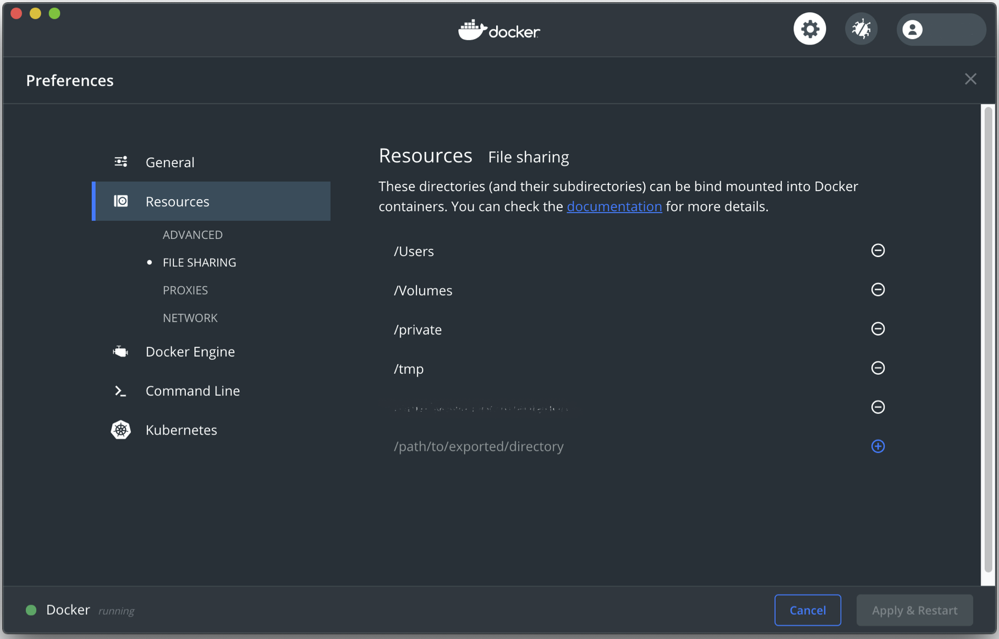
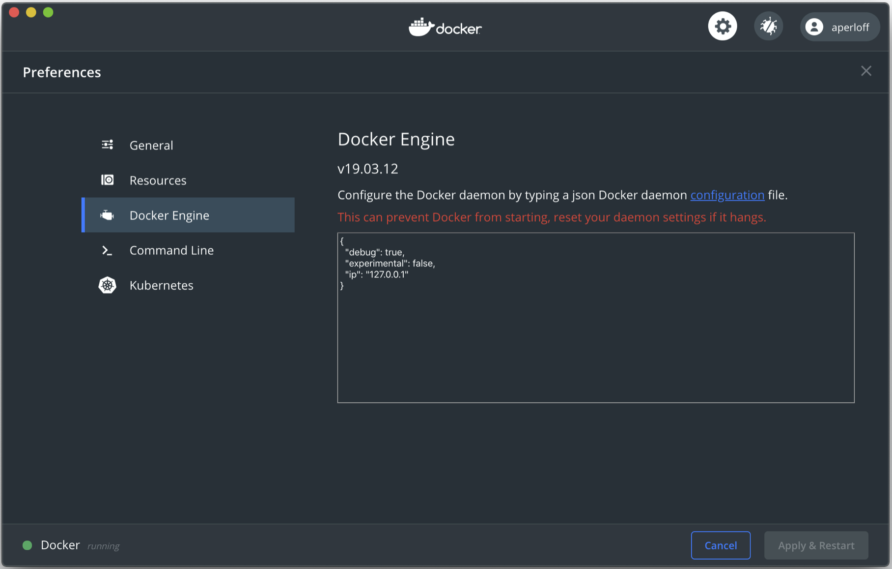

# Best practices for building/choosing/running containers [^1],[^2],[^3]

* Containers should be as *ephemeral* as possible; that means that they should be able to be stopped, destroyed, and recreated with a minimum of effort. In other words, they should be stateless, with any data that must be preserved residing in a stateful backing service (i.e. save your data to a mounted volume).
* Understand your build context -- the directory in which you issue the build command -- and know what's in it. Including extra files can unnecessarily bloat your image.
* Understand why you're creating each layer in the container and make sure it is necessary.
* Don’t install unnecessary packages. Beyond increasing the size of your image, these can open unintended security holes.
* Decouple containers/applications when possible. This means you should *not* have one massive container for every purpose. This isn't a hard rule, but simply helpful for speed and flexibility. This will also make it easier to secure your containers.
* Remember, to keep security in mind when choosing an image to run. If you have a choice of (base) images, run the more secure version.
* Choose a specific tag for your base image, don't rely on the `latest` tag. Doing so may mean that your images changes on subsequent builds and is not necessarily using the (secure) image you intended.
* Only provide as many permissions and capabilities as necessary to run the container. Limiting the capabilities of the container can significantly increase the security of said container.
* **DO NOT, DO NOT, DO NOT** store sensitive information in your Docker images. This can leak your private information into the public domain. There are ways to access sensitive files or credentials which are stored outside of the container.

# The Docker daemon (dockerd) [^4]

Unless you're running in [rootless mode (experimental)][docker-docs-security-rootless], the Docker daemon must be run as the root user on the home machine. This means that it has significant privileges on the host machine. Be careful when mounting directories into the container. The container can then modify the host filesystem, which can cause issues if you add/delete to the wrong directory. Think `rm -rf /`.

Some of this danger can be mitigated by limiting which directories can be bind mounted within the container. These settings are found in *Preferences* -> *Resources* -> *File Sharing*.

There are many more implications to the Docker daemon being run as the root user. However, what we've discussed is sufficient for most people running on their own computer. We encourage you to do your own research into the subject if you are an administrator of a shared computing resource.

# Ports [^4]

By construction, Docker isolates each container in its own namespace. This means that the processes in one container cannot see or affect those in another container or the host. Furthermore, each container is given its own, isolated network stack. 

That said, the user can choose to specify public ports and link containers or the host. Take care when opening ports to your docker container. Open ports are the way by which an intruder can get into your system. Even if your host machine is locked down, the same may not be true of the remote machine. If you then open a port between the remote machine and the host, the intruder can get into your computer and your network via the remote machine.

By default the Docker daemon will bind open ports to the ip address 0.0.0.0. To change this default address you can either use the daemon directly using the command `dockerd --ip <ip_address>` or by going to *Preferences* -> *Docker Engine* and adding the line `"ip": "<ip_address>"`. It's a good practice to bind ports to the `localhost`, which is address `127.0.0.1`. This will prevent container ports from being bound to an arbitrary address.

> ## Note for Linux users
> If you're on Linux, Docker has its own table in `iptables`. If you have a host port which is firewalled or otherwise inaccessible, binding a port in Docker may silently open a hole in the firewall.
> 
{: .callout}

# Container users [^5]

By default the user inside the container is `root`. This raises some serious security concerns. While having a `root` user inside the container is not necessarily bad, adding a non-root user inside the container can add a small level of protection, especially in production environments. Yes, often times the container user can break out and become `root`, but that is not a good excuse for abdicating our responsibility to secure the images we create.

# Privileged containers [^6],[^7]

Be wary of using a privileged container (i.e. using the `--privileged` flag). This gives the container `root` privileges on the host machine, which is necessary when the container needs direct hardware access. With `root` access to the container it is possible for the user to escape the container and interact with the host system. Instead of granting full host access to the container, there are ways of giving the container access to a subset of "capabilities."

# SSH

Unless it's necessary for your containerized application, it's probably not a good idea to run an ssh service inside the container in order to access it. As we've shown, there are better and more secure ways to do this. Running your own service inside a container means you will need to follow good security practices.

# Base image choice

Not everyone will build a Docker image. However, for those of you that do it is important to keep in mind the capabilities and security of your chosen base image. Many of the systems we use at labs and universities are security hardened versions of commercial Linux distributions (i.e. [Scientific Linux][scientific-linux]). Often it is possible to use these specific Linux distributions as base images (i.e. [Official containers for Scientific Linux (SL)][docker-hub-sl]). Using one of these images is recommended as you will need to do far fewer manual modifications in order to secure your container.

If you're using a base image which has an unverified provenance, you may want to: [^2]
* find out how the image was created and know what packages are installed into the image.
* verify that the image wasn't modified after its creation. You can use the SHA256 digest to do this. In other contexts the digest is known as a checksum. You can view the digests for all of your pulled images by doing `docker images --digests`.
* scan for security vulnerabilities. There are tools to do this sort of static analysis, but that goes far beyond this document.

# Fermilab computing

When on the Fermilab network we must follow the [Fermilab Policy on Computing][fnal-computing] at all times. This applies event to containers. If there is an activity which is restricted or prohibited on the host system, then in general it is likewise restricted or prohibited on the remote system. To be safe, any setting or configuration which applies to the host machine must also be set on the remote machine (i.e. ssh configuration parameters).

If your system is deemed to be in violation of the FNAL computing policies it will first be blocked from the Fermilab network. You may receive and email listing the violated security policies, but that may not show up on your computer if you've been blocked from the network. This should not be taken lightly as in the computing policy it says, "Individuals who violate this policy will be denied access to laboratory computing and network facilities and may be subject to further disciplinary action depending on the severity of the offense."

We list this not to scare you or discourage the use of containers, but to remind you that the duty to keep the Fermilab network safe rests with all of us. This goes for Fermilab and all of the networks on which we work.

[fnal-computing]: https://cd-docdbcert.fnal.gov/cgi-bin/cert/RetrieveFile?docid=1186&filename=Fermilab_Policy_on_Computing.pdf&version=16
[docker-docs-dockerfile_best-practices]: https://docs.docker.com/develop/develop-images/dockerfile_best-practices/
[docker-docs-security]: https://docs.docker.com/engine/security/security/
[docker-docs-security-rootless]: https://docs.docker.com/engine/security/rootless/
[osx-sip]: https://support.apple.com/en-us/HT204899
[scientific-linux]: https://scientificlinux.org/
[docker-hub-sl]: https://hub.docker.com/_/sl
[docker-best-practices-and-anti-patterns]: https://medium.com/better-programming/docker-best-practices-and-anti-patterns-e7cbccba4f19
[best-practices-for-building-containers]: https://cloud.google.com/solutions/best-practices-for-building-containers
[docker-image-security-best-practices]: https://snyk.io/blog/10-docker-image-security-best-practices/
[escaping-docker-privileged-containers]: https://medium.com/better-programming/escaping-docker-privileged-containers-a7ae7d17f5a1
[why-running-a-privileged-container-in-docker-is-a-bad-idea]: https://www.trendmicro.com/en_us/research/19/l/why-running-a-privileged-container-in-docker-is-a-bad-idea.html

[^1]: [Dockerfile Best Practices][docker-docs-dockerfile_best-practices]
[^2]: [Docker Best Practices and Anti-Patterns][docker-best-practices-and-anti-patterns]
[^3]: [Best Practices for Building Containers][best-practices-for-building-containers]
[^4]: [Docker Security][docker-docs-security]
[^5]: [Docker Image Security Best Practices][docker-image-security-best-practices]
[^6]: [Escaping Docker Privileged Containers][escaping-docker-privileged-containers]
[^7]: [Why Running A Privileged Container in Docker Is a Bad Idea][why-running-a-privileged-container-in-docker-is-a-bad-idea]

