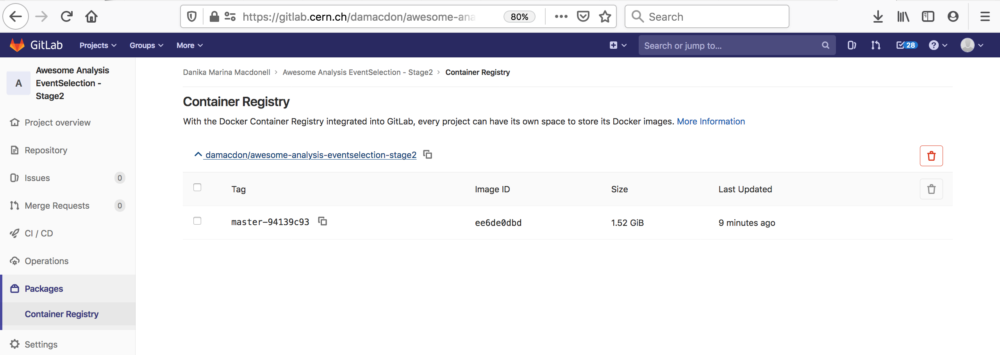

# Introduction

In a similar way to [running CMSSW in GitLab][gitlab-cms-lesson], the
images containing only the base operating system (e.g. Scientific Linux 5/6
or CentOS 7/8) plus additionally required system packages can be used to run
CMSSW (and other related software). CMSSW needs to be mounted via CVMFS.

In this section, we learn how to combine the forces of Docker and GitLab CI to automatically keep our analysis environment up-to-date. This is accomplished by adding an extra stage to the CI pipeline for each analysis repo, which builds a container image that includes all aspects of the environment needed to run the code. 

# Adding analysis code to a light-weight container

Instead of using these containers only for compiling and
[running CMSSW][gitlab-cms-lesson-running], we can add our (compiled) code to
those images, building on top of them. The advantage in doing so is that you
will effectively be able to run your code in a version-controlled sandbox, in
a similar way as grid jobs are submitted and run. Adding your code on top of
the base image will only increase their size by a few Megabytes. CVMFS will
be mounted in the build step and also whenever the container is executed.
The important conceptual difference is that we do not use a *Dockerfile* to
build the image since that would not have CVMFS available, but instead we use
Docker *manually* as if it was installed on a local machine.

The way this is done is by requesting a **docker-privileged** GitLab runner.
With such a runner we can run Docker-in-Docker, which allows to manually
attach CVMFS to a container and run commands such as compiling analysis code
in this container. Compiling code will add an additional layer to the
container, which consists only of the effect of the commands run. After
exiting this container, we can tag this layer and push the container to the
container registry.

The *YAML* required looks as follows:

~~~
build_docker:
  only:
    - pushes
    - merge_requests
  tags:
    - docker-privileged
  image: docker:19.03.1
  services:
  # To obtain a Docker daemon, request a Docker-in-Docker service
  - docker:19.03.1-dind
  before_script:
    - docker login -u $CI_REGISTRY_USER -p $CI_BUILD_TOKEN $CI_REGISTRY
    # Need to start the automounter for CVMFS:
    - docker run -d --name cvmfs --pid=host --user 0 --privileged --restart always -v /shared-mounts:/cvmfsmounts:rshared gitlab-registry.cern.ch/vcs/cvmfs-automounter:master
  script:
    # ls /cvmfs/cms.cern.ch/ won't work, but from the container it will
    # If you want to automount CVMFS on a new docker container add the volume config /shared-mounts/cvmfs:/cvmfs:rslave
    - docker run -v /shared-mounts/cvmfs:/cvmfs:rslave -v $(pwd):$(pwd) -w $(pwd) --name ${CI_PROJECT_NAME} ${FROM} /bin/bash ./.gitlab/build.sh
    - SHA256=$(docker commit ${CI_PROJECT_NAME})
    - docker tag ${SHA256} ${TO}
    - docker push ${TO}
  variables:
    FROM: gitlab-registry.cern.ch/cms-cloud/cmssw-docker/cc7-cms:latest
    TO: ${CI_REGISTRY_IMAGE}:${CI_COMMIT_SHORT_SHA}
~~~
{: .language-yaml}

This is pretty complicated, so let's break this into smaller pieces.

The `only` section determines when the step is actually run. The default
should probably be `pushes` only so that a new image is built whenever there
are changes to a branch. If you would like to build a container already when
a merge request is created so that you can test the code before merging, also
add `merge_requests` as in the example provided here.

The next couple of lines are related to the special Docker-in-Docker runner.
For this to work, the runner needs to be **privileged**, which is achieved by
adding `docker-privileged` to the `tags`. The image to run is then
`docker:19.03.1`, and in addition a special `service` with the name
`docker:19.03.1-dind` is required.

Once the runner is up, the `before_script` section is used to prepare the
setup for the following steps. First, the runner logs in to the GitLab image
registry with an automatically provided token (this is a property of the job
and does not need to be set by you manually). The second command starts a
special container, which mounts CVMFS and makes it available to our analysis
container.

In the `script` section the analysis container is then started, doing the following:

- mounting the volume (`-v /shared-mounts/cvmfs:/cvmfs:rslave`),
- mounting the current working directory (`-v $(pwd):$(pwd)`),
- setting the current working directory mounted as working directory inside the container (`-w $(pwd)`),
- settings its name to the project name (`--name ${CI_PROJECT_NAME}`),
- and executing the command `/bin/bash ./.gitlab/build.sh`.

The name of the image that is started is set via the `${FROM}` variable,
which is set to be `gitlab-registry.cern.ch/cms-cloud/cmssw-docker/cc7-cms:latest` here.

After the command that has been run in the container exits, a new *commit*
will have been added to the container. We can find out the hash of this
commit by running `docker commit ${CI_PROJECT_NAME}` (this is why we set the
container name to `${CI_PROJECT_NAME}`). With the following command, we then
*tag* this commit with the repository's registry name and a unique hash that
corresponds to the `git` commit at which we have built the image. This allows
for an easy correspondence between container name and source code version. The last command simply pushed this image to the registry.

> ## Recommended Tag Structure
> You'll notice the environment variable `TO` in the `.gitlab-ci.yml` script above. This controls the name of the Docker image that is produced in the CI step. Here, the image name will be `<reponame>:<short commit SHA>`. The shortened 8-character commit SHA ensures that each image created from a different commit will be unique, and you can easily go back and find images from previous commits for debugging, etc. 
>
> If you feel it's overkill for your specific use case to save a unique image for every commit, you can replace `$CI_COMMIT_SHORT_SHA` with `$CI_COMMIT_REF_SLUG`, which will at least ensure that images built from different branches will not overwrite each other, and tagged commits will correspond to tagged images.
{: .callout} 

> ## Exercise: Compile the analysis code inside the container
>
> The one thing that has not yet been explained is what the `build.sh` script
> does. This file needs to be part of the repository and contains the commands required to compile the code.
>
> > ## Solution: Compile the analysis code inside the container
> >
> > A possible solution could look like this:
> >
> > ~~~
> > #!/bin/bash
> >
> > # exit when any command fails; be verbose
> > set -ex
> > 
> > # make cmsrel etc. work
> > shopt -s expand_aliases
> > export MY_BUILD_DIR=${PWD}
> > source /cvmfs/cms.cern.ch/cmsset_default.sh
> > cd /home/cmsusr
> > cmsrel CMSSW_10_6_8_patch1
> > mkdir -p CMSSW_10_6_8_patch1/src/AnalysisCode
> > mv ${MY_BUILD_DIR}/MyAnalysis CMSSW_10_6_8_patch1/src/AnalysisCode
> > cd CMSSW_10_6_8_patch1/src
> > cmsenv
> > scram b
> > ~~~
> > {: .language-bash}
> {: .solution}
{: .challenge}

> ## Why the `.gitlab` directory?
>
> Putting the `build.sh` script into a directory called `.gitlab` is a recommended convention. If you develop code locally (e.g. on LXPLUS), you will have a different directory structure. Your analysis code will reside within `CMSSW_10_6_8_patch1/src/AnalysisCode`, and executing the script from within the repository's top level directory does not make much sense, because then you will create a CMSSW work area within an existing one. Therefore, using a hidden directory with a name that makes it clear that this is for running within GitLab, and is ignored otherwise, can be useful.
>
{: .testimonial}

# Using a Dockerfile

If a CVMFS mount is not necessary for your build (i.e. your code doesn't rely on CMSSW or you're using a full container) you can use a *Dockerfile*, along with GitLab CI, to specify your build commands and keep your analysis environment up-to-date.

## Writing your GitLab Dockerfile

The goal of automated environment preservation is to create a Docker image in which you can **immediately** start executing your analysis code upon startup. Let's review the needed components for this.

 * Set up the OS, system libraries, and other dependencies for your code,
 * Add your analysis code to the container, and 
 * Build the code so that it can be trivially executed inside the container.

As we've seen, all these components can be encoded in a Dockerfile. So the first step to set up automated image building is to add a Dockerfile to the repo specifying these components. 

> ## The `rootproject/root:6.22.02-conda` docker image
> In this tutorial, we build our analysis environments on top of the `rootproject/root:6.22.02-conda` base image ([link to project area on Docker Hub](https://hub.docker.com/r/rootproject/root/tags)). This image comes with root 6.22.02 and python 3.7 pre-installed. It also comes with XRootD for downloading files from EOS.
{: .callout}

> ## Exercise
> Working from your bash shell, cd into the top level of the repo you would like to containerize. Create an empty file named `Dockerfile`. 
>
> ~~~bash
> touch Dockerfile
> ~~~
> {: .source}
> 
> Now open the Dockerfile with a text editor and, starting with the following skeleton, fill in the FIXMEs to make a Dockerfile that fully specifies your analysis environment in this repo. 
> 
> ~~~yaml
> # Start from the rootproject/root:6.22.02-conda base image
> [FIXME]
> 
> # Put the current repo (the one in which this Dockerfile resides) in a directory of your choosing
> # Note that this directory is created on the fly and does not need to reside in the repo already
> [FIXME] 
> 
> # Make directory containing your repo the default working directory (again, it will create the directory if it doesn't already exist)
> [FIXME]
> 
> # Compile an executable from source.
> # For example, you can compile an executable named 'skim' from the skim.cxx source file
> RUN echo ">>> Compile skimming executable ..." &&  \
>     COMPILER=[FIXME] && \
>     FLAGS=[FIXME] && \
>     [FIXME]
> ~~~
> {: .source}
>
> > ## Solution
> > ~~~yaml
> > # Start from the rootproject/root-conda base image
> > FROM rootproject/root:6.22.02-conda
> > 
> > # Put the current repo (the one in which this Dockerfile resides) in the /analysis/skim directory
> > # Note that this directory is created on the fly and does not need to reside in the repo already
> > COPY . <analysis_dir>
> > 
> > # Make /analysis/skim the default working directory (again, it will create the directory if it doesn't already exist)
> > WORKDIR <analysis_dir>
> > 
> > # Compile an executable from source.
> > # For example, you can compile an executable named 'skim' from the skim.cxx source file
> > RUN echo ">>> Compile skimming executable ..." &&  \
> > COMPILER=$(root-config --cxx) &&  \
> > FLAGS=$(root-config --cflags --libs) &&  \
> > $COMPILER -g -std=c++11 -O3 -Wall -Wextra -Wpedantic -o skim skim.cxx $FLAGS
> > ~~~
> > {: .source}
> {: .solution}
> 
> Once you're happy with your Dockerfile, you can commit it to your repo and push it to GitHub.
{: .challenge}

> ## Hints
> As you're working, you can test whether the Dockerfile builds successfully using the `docker build` command. Eg.
> ~~~bash
> docker build -t payload_analysis .
> ~~~
> {: .source}
> 
> When your image builds successfully, you can `run` it and poke around to make sure it's set up exactly as you want, and that you can successfully run the executable you built:
> ~~~bash
> docker run -it --rm payload_analysis /bin/bash
> ~~~
> {: .source}
> 
> While this example used `root` to compile some code, this process will also work with scram when using the full CMSSW images.
{: .callout}

Now, you can proceed with updating your `.gitlab-ci.yml` to actually build the container during the CI/CD pipeline and store it in the GitLab registry. You can later pull it from the gitlab registry just as you would any other container, but in this case using your CERN credentials. 

Add the following lines at the end of the `.gitlab-ci.yml` file to build the image and save it to the Docker registry. 

~~~yaml
build_image:
  stage: build
  variables:
    TO: $CI_REGISTRY_IMAGE:$CI_COMMIT_REF_SLUG-$CI_COMMIT_SHORT_SHA
  tags:
    - docker-image-build
  script:
    - ignore
~~~
{: .source}

Once this is done, you can commit and push the updated `.gitlab-ci.yml` file to your gitlab repo and check to make sure the pipeline passed. If it passed, the repo image built by the pipeline should now be stored on the docker registry, and be accessible as follows:

~~~bash
docker login gitlab-registry.cern.ch
docker pull gitlab-registry.cern.ch/[repo owner's username]/[skimming repo name]:[branch name]-[shortened commit SHA]
~~~
{: .source}

You can also go to the container registry on the gitlab UI to see all the images you've built:

 

Notice that the script to run is just a dummy 'ignore' command. This is because using the docker-image-build tag, the jobs always land on special runners that are managed by CERN IT which run a custom script in the background. You can safely ignore the details.


