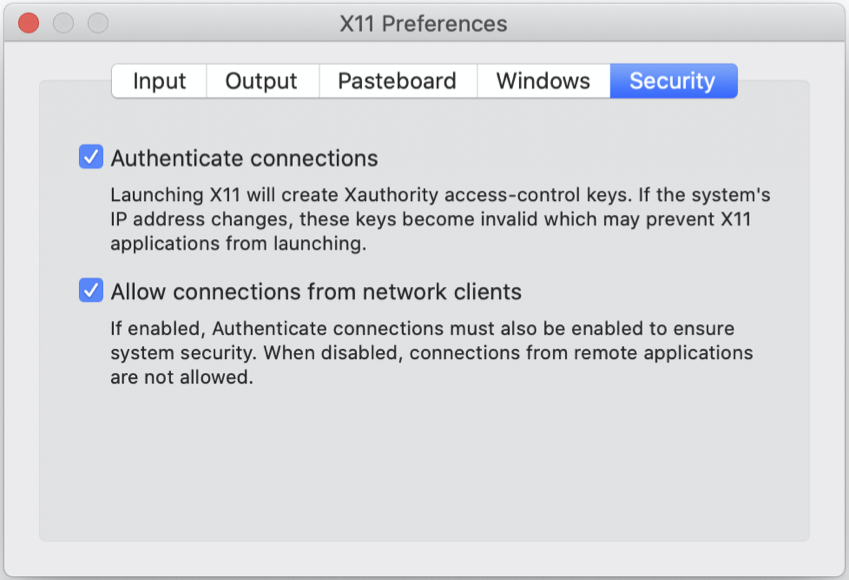

## Docker installation

> ## Do this before coming to Fermilab
> We strongly urge you not to download or update Docker Desktop while on the Fermilab network. This includes while signed onto the VPN. Do this before you come to the tutorial. It's okay to use Docker Desktop on site, just not to download it.
{: .caution}

To install Docker Community Edition on your Linux, Mac, or Windows 10 (Pro, Enterprise, and Education) machine follow the [instructions in the Docker docs](https://docs.docker.com/get-docker/). If you are using Windows 10 Home you will need to follow [this Docker doc](https://docs.docker.com/docker-for-windows/install-windows-home/). Fair warning, the Windows 10 Home installation is more involved and requires Windows Subsystem for Linux 2 (WSL2), among other intricacies.

## Docker Hub

To sign up for Docker Hub, follow the instructions [here](https://hub.docker.com/signup).

## Docker image pulls

Once you've got docker up and running, do the following docker image pulls in advance to save waiting during the tutorial:

~~~bash
docker pull sl:latest
docker pull sl:7
docker pull aperloff/cms-cvmfs-docker:latest
docker pull gitlab-registry.cern.ch/cms-cloud/cmssw-docker/cc7-cms
docker pull gitlab-registry.cern.ch/cms-cloud/cmssw-docker/cc7-cvmfs
# The next two images are optional.
# You will need 8+25 GB of space available to your Docker Engine.
docker pull fnallpc/fnallpc-docker:pytorch-1.8.1-cuda11.1-cudnn8-runtime-singularity
docker pull cmscloud/standalone:cmssw_10_6_25-slc7_amd64_gcc700
# The same image as the last one is available from CERN's GitLab registry
# docker pull gitlab-registry.cern.ch/cms-cloud/cmssw-docker/cmssw_10_6_25-slc7_amd64_gcc700:latest
~~~

Most of these images are relatively small (a few 100 MB at most). However, the last two images are almost 8 and 25 GB, respecitvely. These may take a good amount of time to download.

## Podman CLI

If you would like to have [Podman CLI](https://podman.io/) installed on your local machine, please follow the [instructions in the Podman documentation](https://podman.io/getting-started/installation). For MacOS these boil down to:

~~~bash
# Install Homebrew
/bin/bash -c "$(curl -fsSL https://raw.githubusercontent.com/Homebrew/install/HEAD/install.sh)"
# Install Podman
brew install podman
~~~

Podman is available for MacOS, Microsoft Windows, and Linux.

## Podman Desktop

To install [Podman Desktop](https://podman-desktop.io/) on your local machine either download an installer or follow the directions [here](https://podman-desktop.io/downloads). For MacOS this boiled down to:

~~~bash
brew install podman-desktop
~~~

Podman Desktop is available for MacOS (universal, Intel, or Arm), Microsoft Windows, and Linux.

## Buildah

[Buildah](https://buildah.io/) is currently only available for Linux. To install it you can follow the directions [here](https://github.com/containers/buildah/blob/main/install.md). However, `podman build` is available for both MacOS and Microsoft Windows and it has embedded within it the buildah code. Unless you need the advanced features of buildah, `podman build` should suffice.

## OS specific setup

### MacOS

Follow the direction to install [XQuartz](https://www.xquartz.org/). Once installed, start the program and navigate to *XQuartz* -> *Preferences* -> *Security*. Make sure that both the "Authenticate connections" and "Allow connections from network clients" checkboxes are selected. If you change any settings, you will need to restart XQuartz.

 

### Microsoft Windows

If you are not using cygwin and want to use X11, you will need to install an xwindow program. A popular options for Windows are xming and 
VcXsrv, though there are others available.

If you would like to use cygwin, you will need to install [winpty](https://github.com/rprichard/winpty) and prefix your docker command like `winpty docker`.

**We will also introduce a VNC option, which doesn't reply on X11.**


